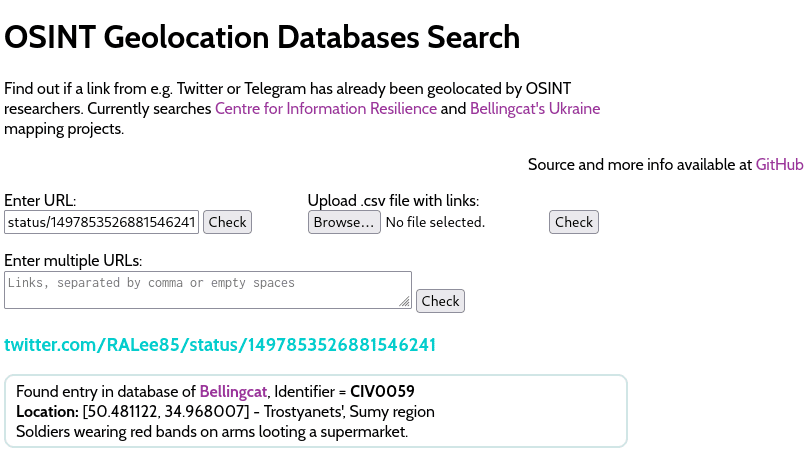

# Media search engine

Check whether a (social) media post already exists in several databases (e.g.
Belllingcat's, Cen4InfoRes).

Has both a **simple web UI** as well as an **API** and a **command-line client**.

### Usage

**Command line**
```sh
# Print all URLs in all databases
python check.py -p
# Print URLs as JSON
python check.py -j
# Seach for a specific URL
python check.py <url>

# Dump data into pre-formatted database so the web API can use it.
python check.py -d
# Load data from pre-formatted database on disk instead of loading the huge
# database files themselves
python check.py -l
```

### Obtaining data
The `Belllingcat` database is from their
[Civilian Harm in Ukraine](https://ukraine.bellingcat.com/) project.
There's an "Export to JSON" button.

The `Cen4InfoRes` database is from the Center for Information Resilience's
[Eyes on Russia map](https://maphub.net/Cen4infoRes/russian-ukraine-monitor).
While we do not want to disclose the link here, you'll have no issue watching
the network tab of your browser and looking for a large JSON file.

### API & Web UI
There's a simple `flask` application with a plain HTML+JS frontend.

Install flask via `pip install flask` and run the server:
```sh
$ python api.py
```

The API part requires you to do a dump of the pre-formatted database beforehand.
Run `python check.py --dump` before you start the API server.

**Available routes**

- `/`: Web UI
- `/api/v1/export` - `GET` - Export all URLs as JSON
- `/api/v1/query` - `GET`/`POST` - Check if URL is in a database  
  **params**: `url`: The url to search (either as request args or as JSON body)  
  **response:**
  ```json
  {
    "dataset": [
      {
        "desc": "ENTRY: UW[...]", 
        "id": "UW13293", 
        "source": "CEN4INFORES"
      }
    ], 
    "message": "Success! Url found in database", 
    "success": true
  }
  ```
  If the entry as not found, `success` is `false`.

**Web UI screenshot:**




### Example
```sh
$ python check.py 'https://twitter.com/RedIntelPanda/status/1488569554028707847'

Found URL https://twitter.com/RedIntelPanda/status/1488569554028707847 in 'CEN4INFORES' dataset
Id: UW0067
Description:

DATE:  01/01/2022
LINK: https://twitter.com/GirkinGirkin/status/1488544876908187650
GEOLOCATION: https://twitter.com/RedIntelPanda/status/1488569554028707847
BRIEF DESCRIPTION: Russian military equipment moving in Belarus
COUNTRY: Belarus
PROVINCE: 
DISTRICT: 
TOWN/CITY: Petrishki
COORDINATES: 54.069385, 27.211645
ARMS/MUNITION: 
VIOLENCE LEVEL: 1
ENTRY: UW0067
```
